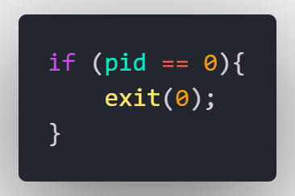

# Round Robin Scheduling 004#

Dessa vez vai em portugues, "sem tempo irmão". De forma resumida o codigo retrata os conceitos de round robin onde sera dado o numero de procesos, o quantum de tempo (unidade de tempo) e o tempo que cada processo leva pra ser completo, claro não é realmente uma implementacão de um Scheduling de Round Robin real mas usa os mesmos conceitos de unidades de tempo tornando o processo preemptivo. Infelizmente não consegui fazer as medicoes de tempo dentro do prazo mas no codigo ja esta presente o processo completo do round robin (espero que considere :smile:).

## How to use ? :gear:


Some of the requirements to run and compile this process on your machine :

* Have a development environment for C language
    * GCC
    * Makefile
    * Vscode
* If you want to contribute 
    * GitHub
    * A Linux operating system 

Talking more about running and compiling this code on your machine, you have the option of compiling in Terminal 

```bash

~$ gcc "FILE NAME".c -o "EXECUTABLE NAME"

```

And after the compilation you just have to run the executable that was created by compiling

```bash

~$ ./"EXECUTABLE NAME"

```

Other way of compiling and running the code in your machine is using the Makefile <br>
(Which currently provides an option to compile, run the executable, and delete the executable to not take up space)

For compiling :
```bash

make         " gcc 'FILE NAME'.c -o 'EXECUTABLE NAME'" 

```
For run the executable
```bash

make run     "./'EXECUTABLE NAME'"

```
For remove the executable from the directory
```bash

make clean   "rm 'EXECUTABLE NAME'"

```
And thats it`s :wink: any questions send me a msg on slack!!
